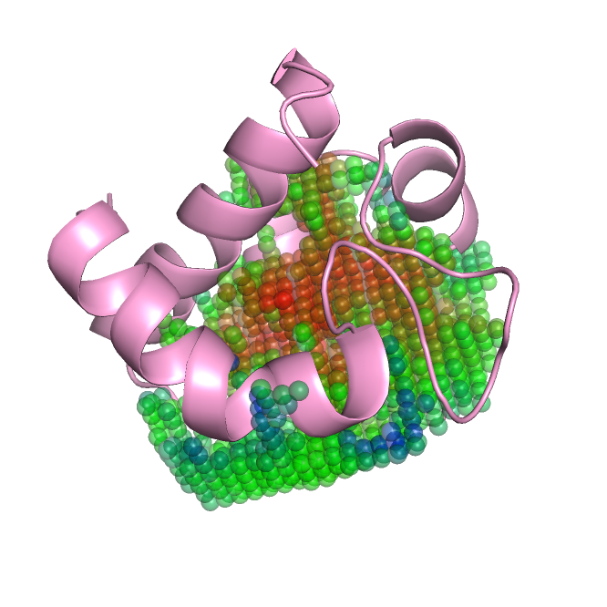

# DeepDrug3D

DeepDrug3D is a tool to predict the protein pocket to be ATP/Heme/other-binding given the binding residue numbers and the protein structure.

If you find this tool useful, please star this repo and cite our paper :)

Pu L, Govindaraj RG, Lemoine JM, Wu HC, Brylinski M (2019) DeepDrug3D: Classification of ligand-binding pockets in proteins with a convolutional neural network. PLOS Computational Biology 15(2): e1006718. https://doi.org/10.1371/journal.pcbi.1006718

This README file is written by Limeng Pu.

    

An example of binding grid generated, pdb ID: 1a2sA, atom type: C.ar. Red --> low potentials while Blue --> high potentials.

# Change Log

**This is a newer version of the implmentation. Since many people are interested in visualize the output from the grid generation like in the image above, I've decided to seperate the data-generation module and the training/prediction module. Another reason for this iteration of implementation is the dligand-linux used for potential calculation requires 32-bit Linux while <em>Pytorch</em> requires 64-bit Linux. It causes confiliction and resulting in different errors depending on the order you install them. Also the deep learning library used has been changed from <em>Keras</em> to <em>Pytorch</em>**.

# Prerequisites

1. System requirement: Linux (DFIRE potential calculation only runs on Linux. Tested on <em>Red Hat Enterprise Linux 6</em>)
2. The data-generation module dependencies are provided in `./DataGeneration/environment.yml`. Please change line 9 in the file according to your system. To install all the dependencies run `conda env create -f environment.yml`.
3. The learning module requires <em>Pytorch</em>. To install it, refer to https://pytorch.org/get-started/locally.

# Usage

The package provides data-generation, prediction, and training modules.

1. Data generation

This module generates data for training/prediction while providing intermediate results for visualization. All files are under `./DataGeneration`. The DFIRE potential calculation uses the module (`./DataGeneration/dligand-linux`) described in `A Knowledge-Based Energy Function for Protein−Ligand, Protein−Protein, and Protein−DNA Complexes by Zhang et al.` since it is written in Fortran, which is faster than our own implementation in Python.

To generate the binding grid data, run `python voxelization.py --f example.pdb --a example_aux.txt --o results --r 15 --n 31 --p`.
  - `--f` input pdb file path.
  - `--a` input auxilary file path, with binding residue numbers and center of ligand (optional). An example of the auxilary file is provided in `example_aux.txt`.
  - `--r` the radius of the spherical grid.
  - `--n` the number of points along the dimension of the spherical grid.
  - `--o` output folder path.
  - `--p` or `--s` whether to calculate the potential nor not. If not, only the binary occupied grid will be returne, i.e., the shape of the grid only. Default, yes (`--p`).

Several files will be saved, including `example_transformed.pdb` (coordinate-transformed pdb file), `example_transformed.mol2` (coordinate-transformed mol2 file for the calculation of DFIRE potential), `example.grid` (grid representation of the binding pocket grid for visualization), and `example.h5` (numpy array of the voxel representation).

To visualize the output binidng pocket grid, run `python visualization --i example.grid --c 0`.
  - `--i` input binding pocket grid file path.
  - `--c` channel to visualize. Note that if you pass `--s` in the previous step, the channel number `--c` has to be 0.
  
An output `example_grid.pdb` will be generated for visualization. Note this pocket grid matches the transformed protein `example_transformed.pdb`.

2. Prediction

This module classifies the target binding pocket to be either an ATP-, Heme-, or other-type pocket, which basically means which type of ligand it tends to binding to. The trained model is available at `https://osf.io/enz69/`. All files are under `./Learning`.

To use the prediction module, run `python predict.py --f example.h5 --m path_to_the_trianed_model`.
  - `--f` input h5 file path.
  - `--m` path to the trained model weights.
  
The output would be something like 

<pre><code>The probability of pocket provided binds with ATP ligands: 0.3000
The probability of pocket provided binds with Heme ligands: 0.2000
The probability of pocket provided binds with other ligands: 0.5000
</code></pre>
 
3. Training

In order to use our model to train your own dataset, you have to convert your dataset, which will be pdbs to voxel representation of protein-ligand biniding grid representation. The data conversion procedure has been descibed before. The module runs a random 5-fold cross validation. All the related results including loss, accuracy and model weights will be saved. All files are under `./Learning`.

The trainig module can be runned as `python train.py --path path_to_your_data_folder --lpath path_to_your_label_file --bs batch_size --lr inital_learning_rate --epoch number_of_epoches --opath output_folder_path`.
  - `--path` path to the folder contains all the voxel data.
  - `--lpath` label file path. The file should be a comma separated file with no header. The first column is the filename and the second column is the class (starts from 0). An example has been provided `./Learning/labels`.
  - `--bs`, `--lr`, `--epoch` is the hyperparameters related to the model. Recommanded values are 64, 1e-5, 50.
  - `--opath` If no output location is provided, a `logs` folder will be created under current working directory to store everything.
  
# Dataset

We provided our dataset we used for the training at https://osf.io/enz69/, which are the voxel representations of ATP, Heme, and other along with the class label file.
